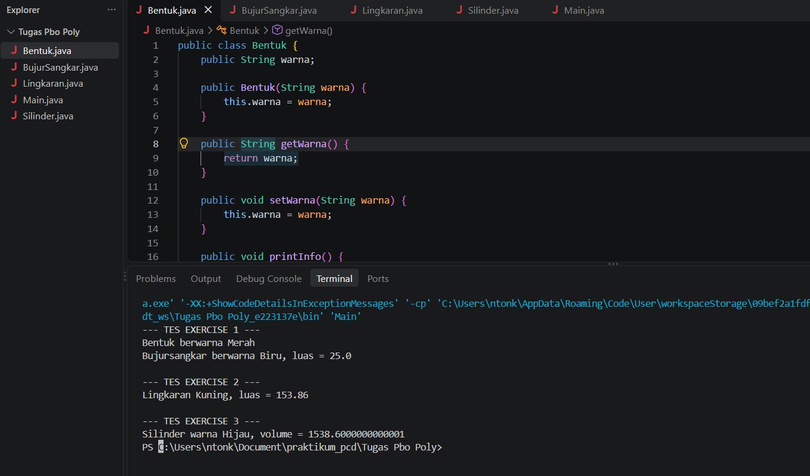

  # Latihan Pemrograman Berorientasi Objek 

### 1. Encapsulation (Enkapsulasi)
Enkapsulasi adalah teknik menyembunyikan data internal suatu kelas menggunakan hak akses (`private` / `protected`) dan menyediakannya melalui *method* akses (`getter` & `setter`).
- **Penerapan pada kode:**
  - Variabel seperti `sisi` di kelas `BujurSangkar`, `radius` di `Lingkaran`, dan `tinggi` di `Silinder` dideklarasikan menggunakan akses modifier `private`.
  - Menggunakan method `getSisi()`, `setSisi()`, `getRadius()`, `setRadius()`, dan seterusnya untuk mengakses dan mengubah nilai variabel tersebut secara aman.

### 2. Inheritance (Pewarisan)
Inheritance memungkinkan suatu kelas (*child class*) untuk mewarisi sifat, variabel, dan *method* dari kelas induknya (*parent class*) menggunakan kata kunci `extends`.
- **Penerapan pada kode:**
  - **`BujurSangkar extends Bentuk`**: Kelas `BujurSangkar` mewarisi atribut `warna` serta method `getWarna()` dan `setWarna()` dari kelas induk `Bentuk`.
  - **`Lingkaran extends Bentuk`**: Kelas `Lingkaran` mewarisi sifat dari kelas induk `Bentuk`.
  - **`Silinder extends Lingkaran`**: Kelas `Silinder` mewarisi sifat dari `Lingkaran`.
### 3. Polymorphism (Polimorfisme / Overriding)
Polymorphism memungkinkan suatu kelas turunan untuk memberikan implementasi khusus pada *method* yang sudah didefinisikan di kelas induknya
- **Penerapan pada kode:**
  - Method `printInfo()` dibuat pada kelas induk `Bentuk`.
  - Kelas `BujurSangkar`, `Lingkaran`, dan `Silinder` masing-masing mendefinisikan ulang isi method `printInfo()` agar mencetak teks dan hasil perhitungan matematika yang spesifik sesuai jenis bentuknya.

